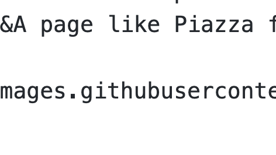

课程资源

- 课程网站：https://cs144.github.io/
- 课程视频：https://www.youtube.com/watch?v=r2WZNaFyrbQ&list=PL6RdenZrxrw9inR-IJv-erlOKRHjymxMN

- 课程作业：https://cs144.github.io/，8 个 Project 带你实现整个 TCP/IP 协议栈

## 1.  Network applications

**Connectivity**

### Dominant model

 Bidirectional, reliable byte stream connection

- One side reads what the other writes.
- operates in both directions 
- Reliable (unless the connection breaks)

This is the building block of most applications today.

### The application level controls communication patterns and payloads.

#### World Wide Web (HTTP)

####  BitTorrent

- The client requested doc from another client.

- dense connection

#### Skype

- NAT 

## 2. An Introduction to Computer Networks

### The 4-layer internet model

